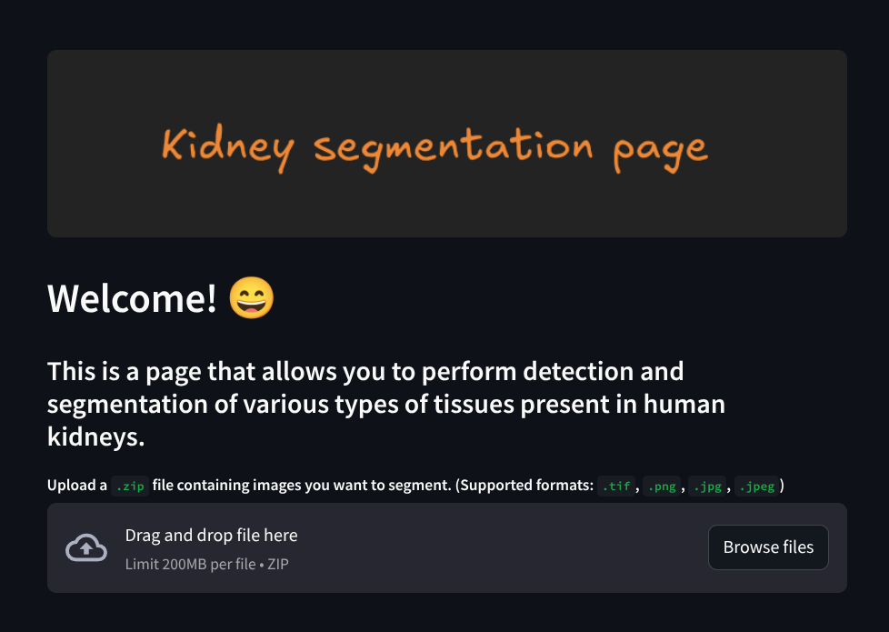
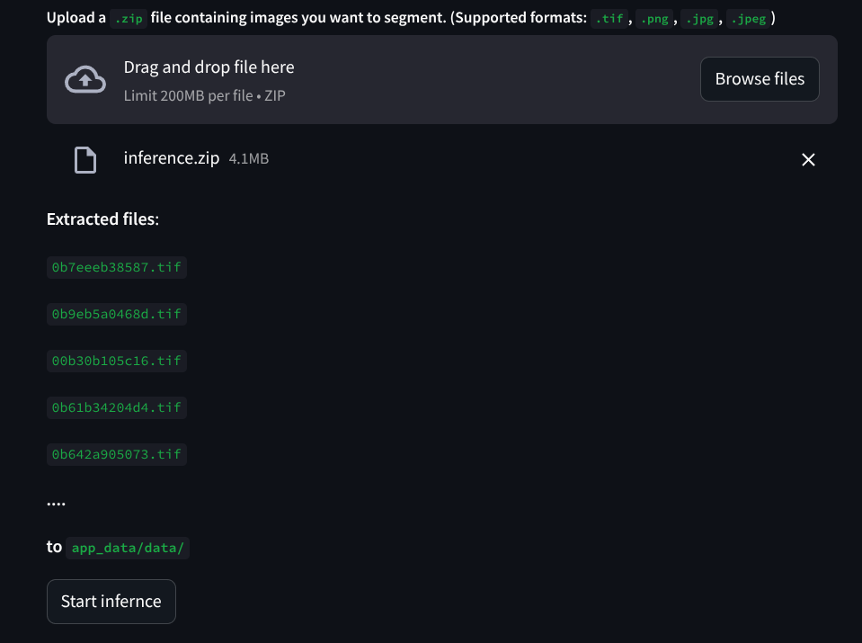
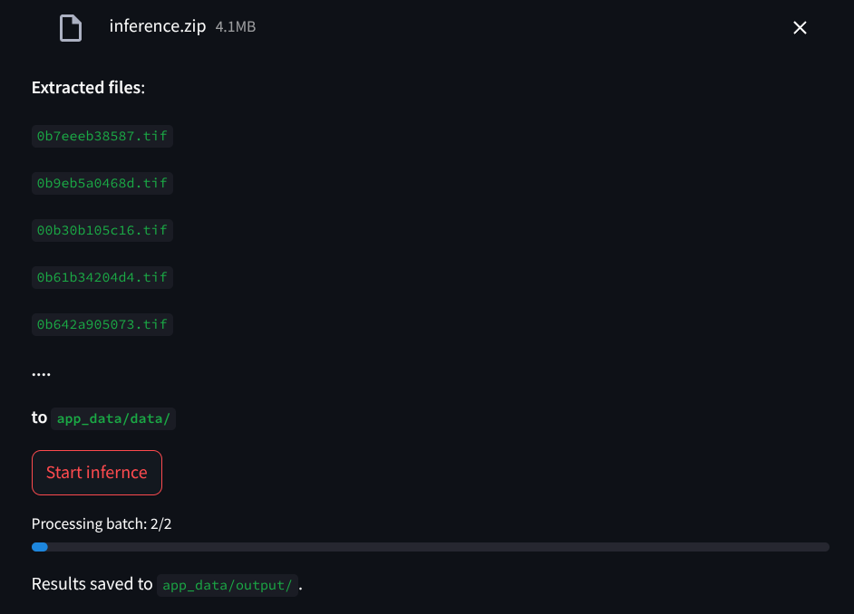
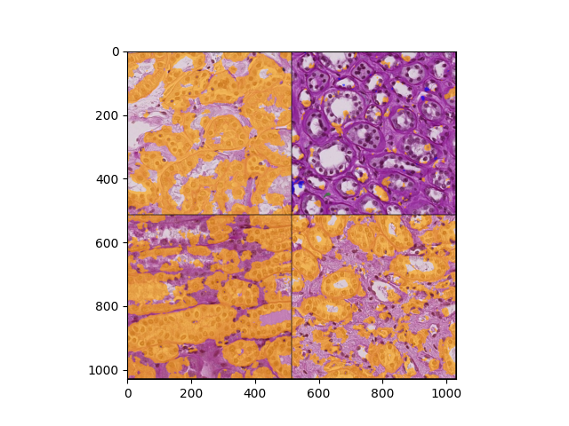

# kidney-segmentation


## 1. Training a Segmentation Model

### 1.1 Setting up the environment
Assuming you're running on the training on Linux you first need the appropriate Python environment. 
1. Install python3 ```apt-install python3 ```
2. Create an env ```python3 -m venv kidney-venv```
3. Activate the env ```source kidney-venv/bin/activate ``` 
4. Navigate to the repository `kidney-segmentation` and run ```pip install -r requriements.txt``` to install the required Python libraries.


### 1.2 Setting up your `configs`
In the `configs` directory, you can find several `.yaml` files that you can play around with.
First `label_ids.yaml` simply maps tensor segmentation classes to integer ids, these are ofcourse
arbitrary so we suggest you do not change them. The file you could play around with more is the
`train_configs.yaml` file which contains all of the relevant information for training your model and logging its progress. 

### 1.3 Getting the data

The training code assumes you have some data in the `data` folder, this default data path can be changed in `train_configs.yaml`. The training data for this project can be downloaded from [Kaggle-HubMap](https://www.kaggle.com/competitions/hubmap-kidney-segmentation/data). Once this is downloaded the training script expects the data to be segregated into `data/train` and `data/test` folders alongisde the `data/polygons.jsonl` file which describes the segmentation region borders.

### 1.4 Model tracking
To track the model training progress, perform model logging, model saving and loading later for inference we use `MLflow`. If you've correctly installed the required python packages from step **1.1** you should already have it installed, now you can open up the terminal and run:
```mlflow server --host 127.0.0.1 --port 44555``` 
The exact host and port you've set up using the above command should match the ones defined in `configs/train_configs.yaml`, specifically you should change the `mlflow_tracking_uri` config parameter to match the host and port defined in the code above. 

All model training logs, model parameters and other artifacts can be found via the web application found on the specified `host` and `port`. In this example you'd type in `http:127.0.0.1:44555` on your browser application of chice. 

### 1.5 Running the training script
The main training script is in `train_model.py` you can run it using `python3 -m train_model`. As it stands the script will train an instance of a U-Net segmentation model defined in `src/model/UNet.py` file, if you wish train a different model feel free to play around with the code yourself. :smile:

The best model will be logged into the MLflow tracking environmet under a specific URI, all of these can be accesed via the MLflow web application descirbed in step **1.4** Lasty, upon training end the best model will be saved to a local directory specified in the `confgis/train_configs.yaml`.


## 2. Model Inference



In order to make the model inference more accesible we've created a simple static inference web application based on `streamlit`. In  the image above you can se the page welcome message and the `.zip` file uploader. 

### 2.1 Starting up the application 

First assure that `app_data/model` directory containes the `final_model` subdirectory which should look somehting like this:
```
app_data
├── data
├── model
│   └── final_model
│       ├── data
│       │   ├── model.pth
│       │   └── pickle_module_info.txt
│       └── MLmodel
├── output
└── resources
```
In this example the `final_model` was generated with MLflow and whichever model you use for inference it should be generated with MLflow and saved to the `app_data/model` folder.

Once that is taken care of you can open up your terminal and run the following command
```  
streamlit run app.py
```
By default the application should be visible on the `http://localhost:8501` address.

### 2.2 Performing inference

Once you open up the application on the above mentioned address, you'll be greeted by a message similar to the one shown in the image in the begining of section **2.** From there on you can simply drag and drop a `.zip` file containing kidney tissue images you want to perform semantic segmentation on.

If the files are sucessfuly uploaded you should encounter a message similar to the one shown below.



Once you're ready for take-off simply press the **Start Inference** button.



As the application prompt says we can find the model results in the `app_data/output` folder. The segmentation regions should look something like this:



**NOTE:** This image shows segmentation results for a very poorly performing model, so the segmentation regions are not necesarily correct.


## 3. Containerizing the application

All we've done so far is fine and well if we intend to run the training procedure, if we're running this on Linux, and if we're lucky enough that the whole process runs on our machine. However, if we intend to make this application somewhat portable across devices and operating systems the authors advise using Docker containters.

[Docker download page](https://docs.docker.com/get-started/get-docker/)

To this end we've made a Dockerfile, that can make a containerized instance of our inference application. Provided we have a model saved in `app_data/model`. For this reason we provide a dummpy UNet instance that gets downloaded with the GitHub repository.

To build the docker image simply navigate to the app folder (the one the `Dockerfile` is in) and run the following comand
```
docker build -t segmentation .
```
**NOTE:** This may require sudo or administrator privilages.
The whole building procedure might take a while, since we're using a fairly large base image, and installing heavy Python libraires such as Pytorch. Once, however, the image is successfuly built you can run it by using the following bulky command
```
docker run -p 8501:8501 --mount type=bind,src=/path_to_your_repo/kidney-segmentation/app_data,dst=/app/app_data segmentation 
```
This command wil bun the built `segmentation` application image, forward host port 8501 to the container port 8501, and mount a volume `/path_to_your_repo/kidney-segmentation/app_data` to the container `app/app_data` folder, that way the segmentation images the docker app creates will be retained after the application is shut down.